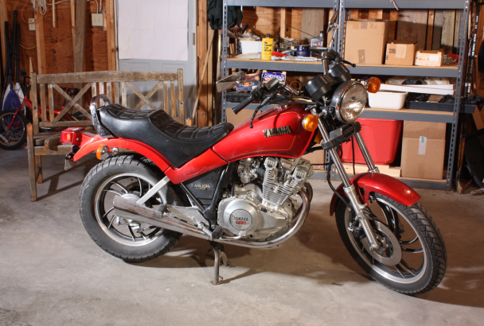
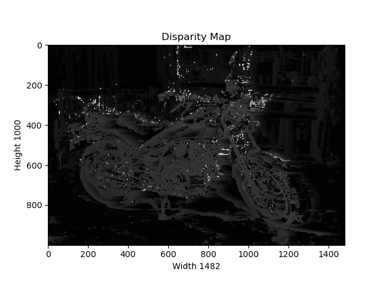
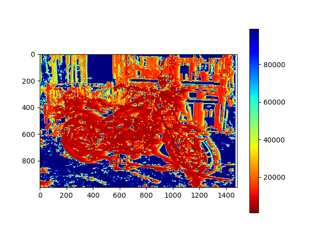

# Stereo Point Cloud Generation
This program used two images taken from cameras aligned on a horizon to create a 3D scene; a point cloud of the environment. This program intends to mimic how are eyes and brain work to provide depth to whatever you are see.
Code folder contains all the coding files, which will be needed.

A detailed explanation of how this algorithm works is provided <a href="./Point-Clouds_from_StereoImages_report.pdf">here</a>.

## Results

<h4>Input Image</h4>

This is an input image that comes from the camera on the left. This and almost identical right shifted image (from the right camera) are the imputs to the algorithmm.

The algorithm initially streo implements blocks matching to match features and regions in both the pictures; which results in a *disparity* map. This is implemented by comparing the similarity of windows around the pixels to be compared, based on the windows matching corresponding pixels are matched. Have a look at the report to understand how the algorithm works in detail.
Using the disparities, we can then calculate the depth for each pixel.

Here are the results for the matching, in the form of disparity and depth map.
Disparity Map | Depth Map
:------------:|:--------------------:
|
## Running

```bash
    python3 main.py
```
